# Recursive vs. Iterative Minimax Ghost – Project Report

## 1. Project Overview

This project extends the UC Berkeley CS188 Pacman framework by implementing **two minimax ghost agents** that use adversarial search to pursue Pacman intelligently. The key modification compares **recursive** vs. **iterative** implementations of the same algorithm to analyze correctness equivalence and performance characteristics.

| Aspect | Detail |
|---|---|
| **Base Framework** | CS188 Multiagent Pacman |
| **Core Task** | Ghosts use Minimax (depth 2) against Reflex Pacman |
| **Version A** | Recursive minimax with alpha-beta pruning |
| **Version B** | Iterative minimax using explicit stack frames |
| **Evaluation** | 50 games per version, recording win rate, decision time, and depth/stack metrics |

---

## 2. System Architecture

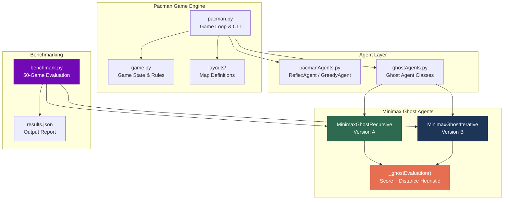

---

## 3. How the Algorithms Work

### 3.1 The Minimax Idea

Minimax is a decision strategy for **two-player zero-sum games**. One player (MAX) tries to **maximize** the outcome, the other (MIN) tries to **minimize** it. Each player assumes the opponent plays **optimally**.

In our Pacman setup:
- **Ghost (self)** = **MAX** — wants the highest evaluation (Pacman dying)
- **Pacman + other ghosts** = **MIN** — assumed to play the worst case for our ghost

The algorithm builds a **game tree** by simulating future moves, then picks the action that leads to the best guaranteed outcome.

### 3.2 Concrete Game Tree Example

Imagine a simplified scenario: Ghost has 2 moves (Left, Right), then Pacman responds with 2 moves each. The leaf nodes are evaluation scores from the ghost's perspective:

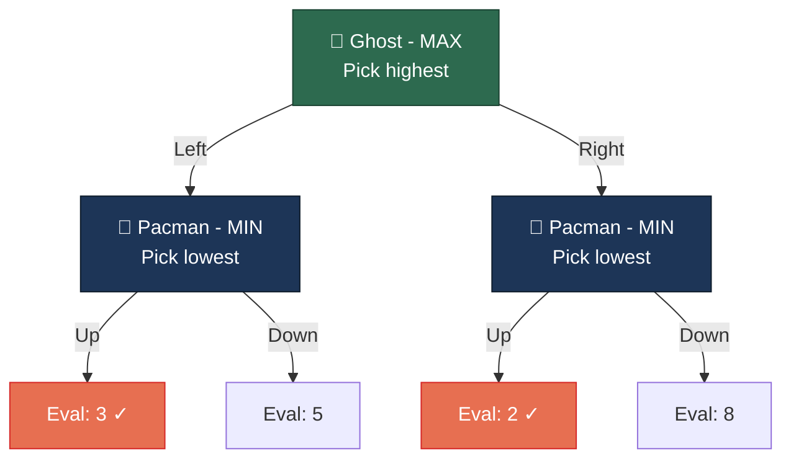

**Step by step:**

| Step | Node | Logic | Result |
|---|---|---|---|
| 1 | Pacman after Ghost-Left | MIN picks min(3, 5) | **3** |
| 2 | Pacman after Ghost-Right | MIN picks min(2, 8) | **2** |
| 3 | Ghost (root) | MAX picks max(3, 2) | **3 → choose Left** |

> The ghost picks **Left** (guaranteed score 3) because even though Right *could* lead to 8, a smart Pacman (MIN) would choose the move giving 2 instead.

### 3.3 Alpha-Beta Pruning — Skipping Unnecessary Work

Without pruning, minimax explores **every leaf**. Alpha-beta introduces two bounds:
- **α (alpha)** — best score MAX can guarantee so far (starts at −∞)
- **β (beta)** — best score MIN can guarantee so far (starts at +∞)

> **Key rule: when α ≥ β, PRUNE** — stop exploring that branch because the result won't affect the final decision.

#### Step-by-step walkthrough with pruning:

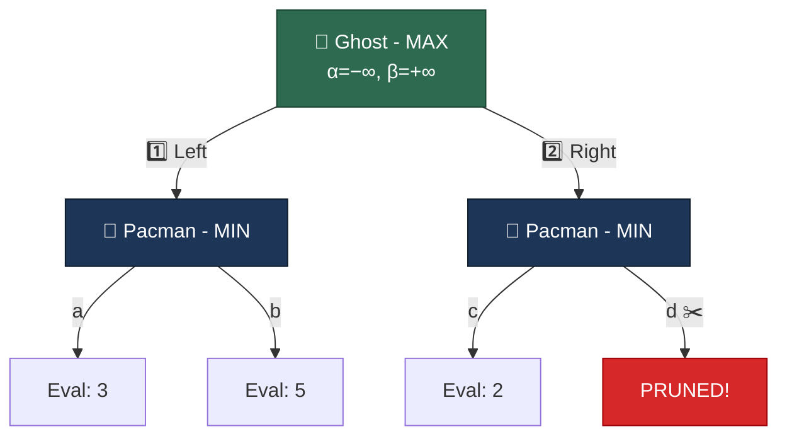

| Step | What happens | α | β | Note |
|---|---|---|---|---|
| 1 | Explore leaf **a** → val=3 | −∞ | 3 | P1 sets β=min(∞,3)=3 |
| 2 | Explore leaf **b** → val=5 | −∞ | 3 | P1: min(3,5)=3, β stays 3 |
| 3 | P1 returns **3** to ROOT | **3** | +∞ | ROOT sets α=max(−∞,3)=**3** |
| 4 | Explore leaf **c** → val=2 | 3 | **2** | P2 sets β=min(∞,2)=2 |
| 5 | **α(3) ≥ β(2) → PRUNE** ✂️ | 3 | 2 | Skip leaf **d** entirely! |
| 6 | P2 returns 2. ROOT: max(3,2)=3 | 3 | +∞ | Best action = **Left** |

> We **never evaluated leaf d** (value 8) because we already knew the Right subtree couldn't beat score 3. This saves computation without changing the result!

### 3.4 Multi-Agent Depth Counting

In Pacman, there are **multiple agents** (Pacman + N ghosts). A "depth" of 2 means the controlling ghost looks **2 full rounds ahead**, where each round has every agent move once:

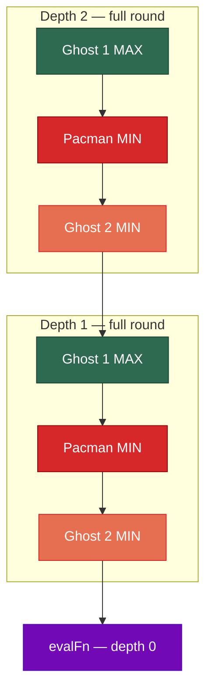

In code, depth only decrements when control **wraps back** to the MAX ghost:
```python
nextAgent = (agentIndex + 1) % numAgents
nextDepth = depth - 1 if nextAgent == self.index else depth
```

### 3.5 Version A — Recursive Implementation

The recursive version is the natural, textbook way to write minimax. Python's **call stack** handles the tree navigation automatically:

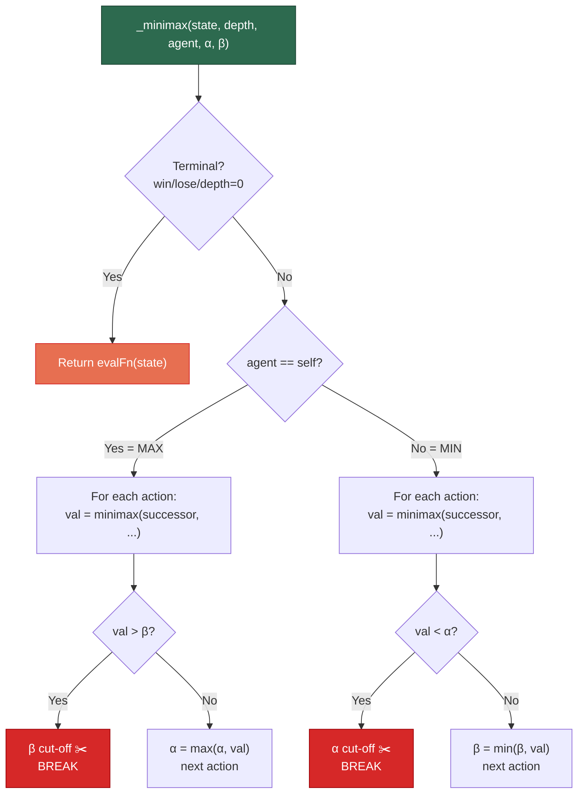

**Simplified code:**
```python
def _minimax(self, state, depth, agentIndex, alpha, beta):
    # Base case
    if state.isWin() or state.isLose() or depth == 0:
        return self.evalFn(state, self.index), None

    nextAgent = (agentIndex + 1) % numAgents
    nextDepth = depth - 1 if nextAgent == self.index else depth

    if agentIndex == self.index:       # MAX node (this ghost)
        bestValue = float('-inf')
        for action in legalActions:
            val, _ = self._minimax(successor, nextDepth, nextAgent, alpha, beta)
            if val > bestValue:
                bestValue, bestAction = val, action
            alpha = max(alpha, bestValue)
            if bestValue > beta: break             # β cut-off ✂️
    else:                              # MIN node (pacman / other ghost)
        bestValue = float('inf')
        for action in legalActions:
            val, _ = self._minimax(successor, nextDepth, nextAgent, alpha, beta)
            if val < bestValue:
                bestValue, bestAction = val, action
            beta = min(beta, bestValue)
            if bestValue < alpha: break            # α cut-off ✂️

    return bestValue, bestAction
```

**Pros:** Simple, readable, direct translation of the algorithm.
**Cons:** Limited by Python's recursion depth (~1000 calls).

### 3.6 Version B — Iterative Implementation with Explicit Stack

The iterative version replaces Python's call stack with a **list of dictionaries**, where each dict is a "stack frame". This requires a two-phase state machine:

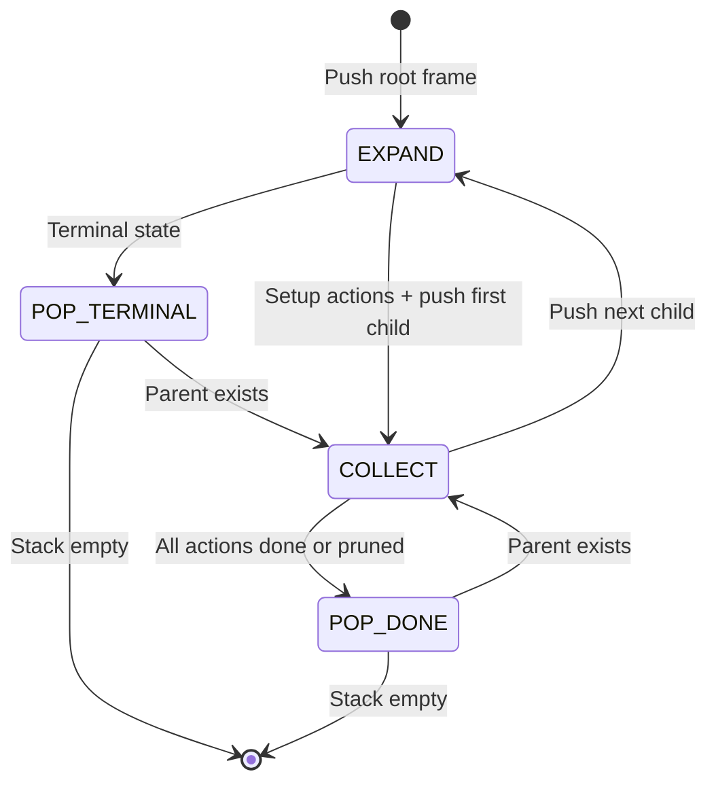

**Each stack frame stores the equivalent of local variables:**
```python
frame = {
    'state':      GameState,   # what recursive call receives as arg
    'depth':      int,         # remaining search depth
    'agentIndex': int,         # whose turn it is
    'alpha':      float,       # α bound (copied from parent)
    'beta':       float,       # β bound (copied from parent)
    'isMax':      bool,        # MAX or MIN node
    'actions':    list,        # legal actions to try
    'actionIdx':  int,         # which action we're currently on
    'bestValue':  float,       # best value seen so far
    'bestAction': str,         # action that gave best value
    'phase':      EXPAND|COLLECT  # which phase we're in
}
```

**How the phases work:**

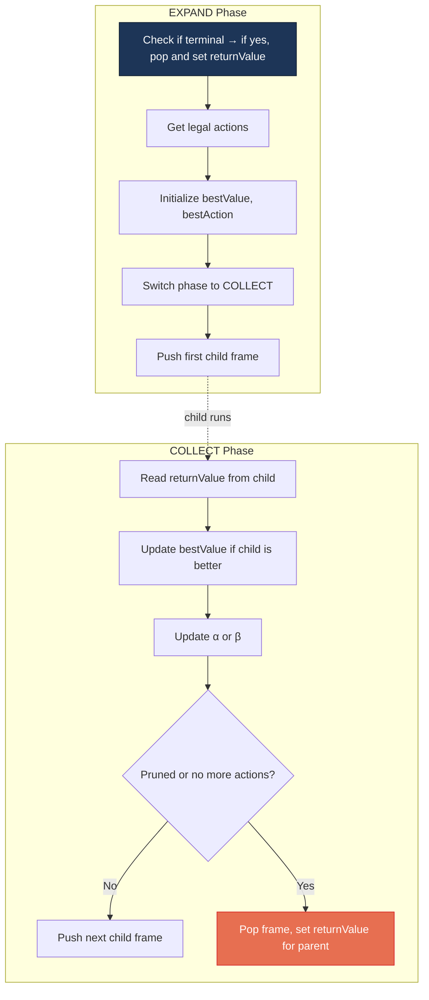

**The key translation rules:**

| Recursive concept | Iterative equivalent |
|---|---|
| Making a recursive call | Push a new frame dict onto the stack |
| Returning a value | Pop the frame, store result in `returnValue` |
| Local variables (`bestValue`, etc.) | Fields in the frame dictionary |
| Passing `α, β` as arguments | Copy from parent frame when pushing child |
| For-loop over actions | `actionIdx` counter incremented in COLLECT |
| Base case check | Done at EXPAND phase → pop immediately |

**Pros:** No recursion limit — can search arbitrarily deep.
**Cons:** ~7% slower due to dict creation overhead; more complex code.

### 3.7 Why Both Produce Identical Moves

Since the iterative version is a **mechanical translation** of the recursive one, they traverse the game tree in **exactly the same order** and apply **the same pruning rules** at every node. This guarantees identical action selection, which we verified empirically:

```
$ python benchmark.py --test-equivalence --layout testClassic
  ✓ PASS – 72 rounds, all ghost moves identical.
```

---

## 4. Evaluation Function

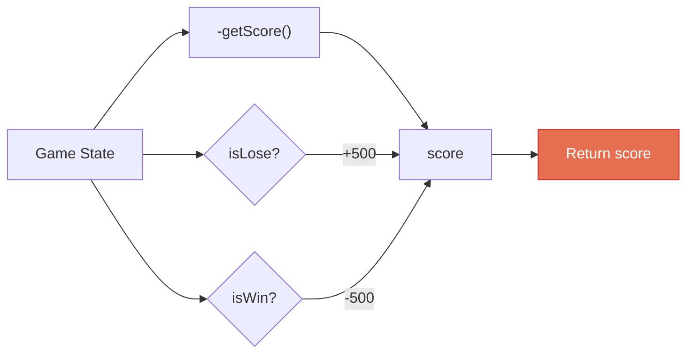

The ghost evaluation **negates** Pacman's score (lower Pacman score = better for ghost), with terminal bonuses:

```python
def _ghostEvaluation(state, ghostIndex):
    score = -state.getScore()
    if state.isLose(): score += 500   # Ghost wins → big bonus
    if state.isWin():  score -= 500   # Ghost loses → big penalty
    return score
```

---

## 5. Benchmark Results

### Configuration
- **Layout**: `originalClassic` | **Ghosts**: 2 | **Depth**: 2 | **Pacman**: ReflexAgent

### Results Summary

| Metric | Version A (Recursive) | Version B (Iterative) |
|---|---|---|
| Ghost Win Rate | 100% | 100% |
| Pacman Win Rate | 0% | 0% |
| Avg Pacman Score | 249.0 | 249.0 |
| Avg Decision Time | 8.518 ms | 9.188 ms |
| Max Recursion Depth / Stack Size | 6 | 7 |
| Decisions per Game | 502 | 502 |

### Performance Comparison

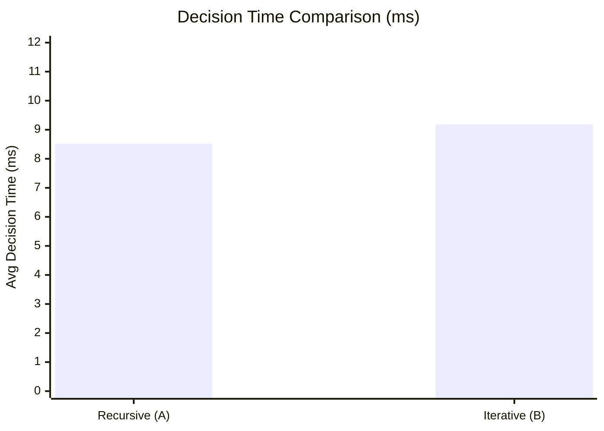

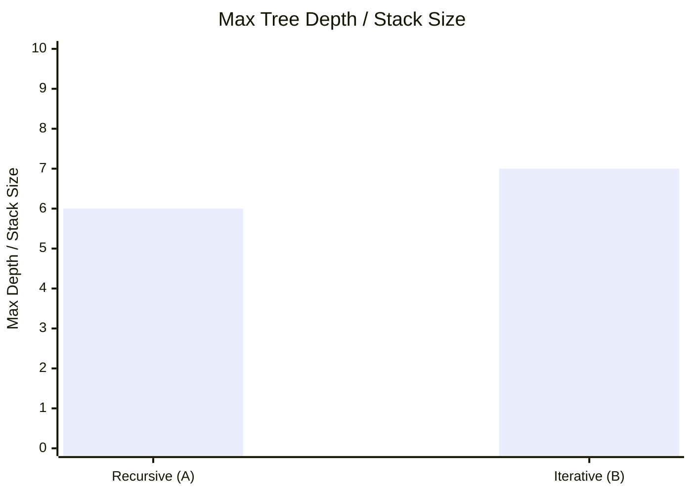

### Key Observations

1. **Behavioral Equivalence** ✅ — Both versions produce identical moves, verified on multiple layouts
2. **Recursive is ~7% faster** — Lower per-call overhead (no dict creation for stack frames)
3. **Iterative uses +1 stack level** — The explicit stack counts the root frame, while recursion depth starts at 0
4. **Trade-off**: Recursive is simpler and faster; Iterative avoids Python's recursion limit for deep searches

---

## 6. File Structure

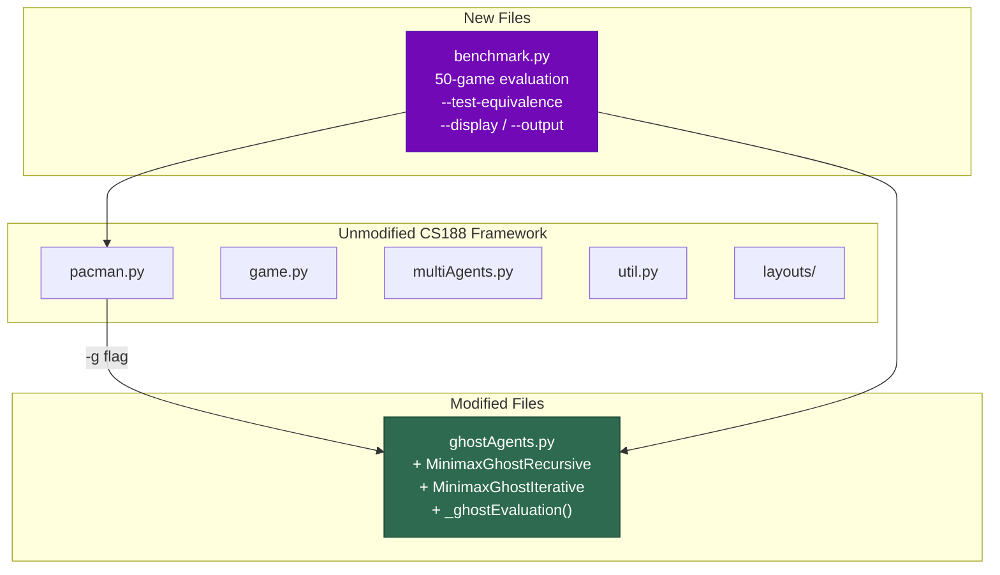

---

## 7. Usage Guide

```bash
# Run with recursive ghost (Version A)
python pacman.py -p GreedyAgent -g MinimaxGhostRecursive -l smallClassic

# Run with iterative ghost (Version B)
python pacman.py -p GreedyAgent -g MinimaxGhostIterative -l smallClassic

# Full 50-game benchmark with JSON output
python benchmark.py --num-games 50 --layout smallClassic -o results.json

# Verify both versions produce identical moves
python benchmark.py --test-equivalence

# Watch games visually
python benchmark.py --display --frame-time 0.05 --num-games 5

# Customize ghosts and depth
python benchmark.py --num-ghosts 2 --depth 3 --layout mediumClassic
```
